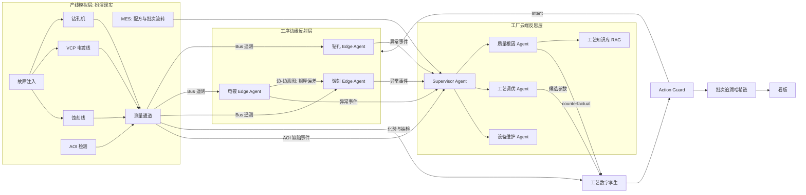

# PCB 产线自主工艺与运维智能体 —— 设计规格

- 状态：待审阅
- 日期：2026-10-08
- 依据论文：Gadekallu et al., *Artificial Intelligence of Things as a Foundation for Agentic AI Systems: Architectures, Applications, and Challenges*, TechRxiv 预印本, DOI: 10.36227/techrxiv.176972132.21250188/v1（`doc/`）
- 相关决策：`docs/decisions/ADR-001` ~ `ADR-006`

## 1. 目标与范围

### 1.1 目标

在纯软件仿真环境中，以 PCB 制板（fab）产线为场景，构建一个可演示、可复现评测的智能体系统，把“AOI 发现缺陷，再由工程师人工分析、调参”的以天计循环，压缩为“智能体自动根因分析、孪生验证、受控调参”的分钟级闭环；同时实现钻针预测性换刀、药水自动补加和断网自治。

### 1.2 覆盖工序

| 工序 | 关键变量 | 典型问题 |
|------|----------|----------|
| 机械钻孔 | 主轴转速、进给、主轴电流/振动、钻针击数 | 断针、钻针磨损导致孔壁粗糙、孔位偏移 |
| VCP 电镀铜 | 槽温、Cu2+ / H2SO4 / Cl- / 添加剂浓度、电流密度（ASD）、整流器电流 | 添加剂消耗漂移、整流器异常，导致铜厚不均 |
| 酸性蚀刻 | 蚀刻液比重、ORP、温度、喷淋压力、传送速度 | 比重漂移、喷嘴堵塞，导致线宽超差、残铜、开路 |
| AOI 检测 | 按批次（lot）、拼板（panel）输出缺陷类型和板面位置 | — |

缺陷类型：开路、短路、缺口、残铜、线宽超差、孔壁不良。

### 1.3 不做（MVP 范围外）

真实设备和 PLC 对接；AOI 图像算法（直接模拟缺陷结果）；联邦学习；区块链；SMT/PCBA 段；3D 可视化与 Omniverse；喷淋流体力学（CFD）仿真；边缘端小语言模型。

### 1.4 研究问题

- RQ1：云边混合智能体相对“纯 SPC 规则 + 人工响应”，一次良率提升多少、缺陷纠正时延缩短多少？
- RQ2：孪生前瞻验证与三道关 Guard 对越界次数、误动作数的影响有多大？
- RQ3：事件触发调用 LLM 时，成本与质量如何取舍？
- RQ4：断网期间边缘自治能把良率保持在什么水平？模型失配增大时，决策质量如何退化？

## 2. 与论文的对应关系

| 论文思想 | 章节 | 本设计中的落点 |
|----------|------|----------------|
| 云-边混合：边缘反射、云端反思 | III-A-3、IV-A | 工序边缘智能体 + 工厂云端多智能体 |
| 层级与网状协同动态切换 | III-B-3 | 平时云端下发策略；工序之间边-边意图前馈；断网后边缘自治 |
| OODA 认知闭环 + 孪生前瞻仿真 | III-C-1、IV-D | 候选方案先经孪生 `simulate`/`compare` 再进入 Guard |
| 意图级语义交互 | III-C-2、IV-B | `Intent` 协议 |
| 实时反馈与自适应纠偏 | III-C-3 | SPC 判异触发重规划 |
| 可审计的动作账本 | IV-C、VII | 批次级哈希链追溯 |
| 工业边缘质检、预测性维护 | V-B | AOI 质量闭环、钻针预测性换刀 |
| 运行时保障、按置信度调节自治 | VI-A、表 IV | 三道关 Guard、传感器置信度、孪生置信度门槛 |
| 按资源调节推理深度 | VI-B | 事件触发才调用 LLM |
| 长时评测与故障/漂移注入、报告仿真与现实差距 | VI-D | `bench/` 场景矩阵、`model_mismatch` 维度 |
| ES / ARG / FPR / CAF 四个风险维度 | 表 IV | 第 7.3 节的量化定义 |

## 3. 总体架构



### 3.1 全局约束

- Python 3.12；依赖用 `pyproject.toml` 管理；测试用 `pytest`。
- 所有随机过程接受 `seed` 参数；同一 seed 必须得到逐位一致的结果。
- 消息总线抽象为 `Bus` 接口，两个实现：`InMemoryBus`（测试与批量评测）和 `MqttBus`（演示）。单元测试不依赖 Mosquitto。
- 仿真时间由 `SimClock` 驱动，与墙钟解耦，评测时可加速。
- 代码标识符用英文；文档和日志说明用中文。
- 第 7.1 节的四类埋点日志是所有模块的共同契约，字段只能新增，不能修改语义。
- `twin/`、`edge/`、`cloud/` 不允许 import `sim/` 的模型代码，只能通过 `sim/measurement.py` 和 `Bus` 获取数据；由 `tests/test_isolation.py` 静态检查。
- LLM 输出视为不可信输入，必须先通过 `Intent` 模式校验和工艺窗口校验才能执行。
- 密钥只从环境变量读取，仓库只提交 `.env.example`。

## 4. 模块设计

### 4.1 产线模拟器 `sim/`（扮演“现实”）

- **工序物理模型**
  - 钻孔 `sim/drill.py`：钻针磨损随击数增长，主轴电流与振动随之上升，孔壁粗糙度上升；磨损超过隐藏阈值后断针概率陡增。
  - 电镀 `sim/plating.py`：铜厚与电流密度 × 时间 × 真实电流效率成正比；真实电流效率随添加剂浓度非线性变化；输出板面 3×3 分区的厚度分布；添加剂随电量消耗。
  - 蚀刻 `sim/etch.py`：侧蚀量由蚀刻速率（比重、温度、各区喷淋压力的函数，含交互项）与停留时间（由传送速度决定）决定，再结合来料铜厚得到线宽。
- **AOI** `sim/aoi.py`：按各工序真实状态以概率生成缺陷，每个缺陷带真实根因工序标签，保证缺陷与工艺状态之间存在可追溯的因果关系。
- **MES** `sim/mes.py`：料号配方（含工艺窗口）、批次在工序间的流转、批次履历（工序参数快照）。
- **故障注入** `sim/faults.py` + `bench/scenarios/*.yaml`：钻针异常磨损/断针、添加剂逐步耗尽、整流器某路电流偏低、蚀刻比重漂移、喷嘴堵塞（含空间分布）、传感器漂移/偏置/欺骗、网络中断。
- **隐藏参数与模型失配**：真实电流效率曲线、板面不均匀、喷嘴堵塞空间分布、参数交互效应、传感器偏置与噪声，对孪生不可见。其强度由场景参数 `model_mismatch`（`low` / `mid` / `high`）统一缩放。
- **测量通道** `sim/measurement.py`：是模拟器对外唯一的数据出口，只提供真实工厂能拿到的数据：
  - 实时遥测（带传感器噪声与偏置）；
  - 槽液化验，周期与延迟可配置；
  - 铜厚抽检与线宽测量（按抽样比例）；
  - AOI 结果。

### 4.2 工序边缘智能体 `edge/`（反射层）

- 每道工序一个实例，订阅本工序遥测。
- **检测**：EWMA 与 SPC 控制图（Western Electric 判异规则），加 IsolationForest。
- **安全包络**：按料号工艺窗口做硬约束，全部本地执行，不经过 LLM。例如钻针到寿命自动换针、断针急停、槽温超限降电流。
- **局部闭环**：药水自动补加（单次上限、每日累计上限）；蚀刻传送速度在窗口内微调。
- **边-边协同**：电镀段把批次实测铜厚以 `Intent` 发送给蚀刻段，蚀刻段用简化线性前馈模型补偿传送速度；前馈系数由云端孪生定期下发。
- **置信度调节**：检测到传感器漂移或欺骗时进入保守模式（收窄可调范围、提高上报优先级）。
- **断网自治**：与云端断连时按工艺窗口自治运行，缓存待上报事件，恢复后补报。

### 4.3 工艺数字孪生 `twin/`（智能体的世界模型）

孪生与模拟器独立建模，只能通过测量通道获取数据（见 ADR-003）。

- **状态层** `twin/state.py`：按工序估计当前状态及不确定度。钻针磨损由主轴电流与振动估计；槽液浓度在化验间隔期间用消耗模型外推，化验到达后修正；蚀刻估计比重、温度、喷淋压力。方法为卡尔曼滤波或简单贝叶斯更新。
- **模型层** `twin/models/`：
  - 电镀：法拉第定律，厚度与电流密度 × 时间 × 电流效率 η 成正比，输出 3×3 分区分布。
  - 蚀刻：侧蚀量 = 蚀刻速率（比重、温度、喷淋压力）× 停留时间（传送速度），结合来料铜厚与蚀刻因子得到线宽。
  - 钻孔：钻针磨损随击数变化的曲线，决定孔壁粗糙度与断针风险。
  - 残差修正：梯度提升树或高斯过程学习“机理预测值减实测值”。
  - 不确定度：集成模型或分位数回归，输出预测分布。
  - 保真度由 `twin_fidelity` 控制：`none`（不提供预测）、`mechanistic`（仅机理）、`hybrid`（机理 + 残差，默认）。
- **校准层** `twin/calibration.py`：有新实测时，用递推最小二乘（RLS）在线更新 η、蚀刻速率系数等；持续统计滚动预测误差与预测区间覆盖率，输出 `twin_confidence`（0~1）。
- **服务层** `twin/service.py`：
  - `simulate(lot, params, horizon) -> Prediction`：预测分布、良率、超规格概率（风险分）。
  - `compare(candidates) -> list[Prediction]`：单个候选不超过 100 毫秒，用 numpy 向量化。
  - `counterfactual(lot_id, hypothesis) -> CounterfactualResult`：按假设修改历史参数后重新预测，判断缺陷是否消失。
- **部署**：完整孪生在云端；边缘只持有简化线性前馈模型。

### 4.4 云端智能体 `cloud/`（反思层）

- 用 LangGraph 编排（见 ADR-002）；LLM 走 OpenAI 兼容接口，模型可配置（Qwen、DeepSeek 等）。
- **触发**：只有边缘上报异常事件，或 AOI 缺陷率越过阈值时才唤醒（见 ADR-004）。默认阈值：最近 5 个批次的缺陷率超过故障前基线均值 + 3σ，可配置。
- **Supervisor Agent**：根据事件类型分派任务。
- **质量根因 Agent**：对 AOI 缺陷按类型、板面位置、批次聚类；用 `query_lot_history` 关联各工序参数快照；结合知识库提出根因假设与置信度。每个假设必须经 `counterfactual` 验证（缺陷预测确实消失）才被采纳，否则驳回或转人工。
- **工艺调优 Agent**：生成候选参数方案，用 `compare` 选优，输出 `Intent`。
- **设备维护 Agent**：基于钻针与主轴健康度、整流器状态生成维护工单与换刀计划。
- **知识库 RAG**（Chroma）：工艺规范、FMEA、IPC-A-600 / IPC-6012 判定要点摘要、模拟历史 8D 报告。可评估复用 `D:/workspace` 中已有的 PCB 制造知识库作为数据源。

### 4.5 意图协议 `common/intents.py`

Pydantic 模型 `Intent`，字段：`intent`、`target_process`、`lot_id`、`params`、`recipe_window`、`deadline`、`rationale`、`policy_version`。云边、边边之间均使用此格式，不传原始数据。

### 4.6 安全与追溯 `guard/`

- **三道关**（按顺序）：
  1. 参数必须落在料号工艺窗口内；
  2. 孪生预测的良率与风险分达标，门槛随 `twin_confidence` 下降而收紧；
  3. 高风险动作（改配方、停线、批次扣留、报废）需工艺工程师在看板上审批。
- **追溯**：每条感知、决策、动作带批次号，写入 SQLite 哈希链（见 ADR-006），支持按批次回答“为什么被这样处理”，并可校验链是否被篡改。

### 4.7 看板 `ui/`（Streamlit）

工序实时曲线与 SPC 图；AOI 缺陷柏拉图与板面热力图；智能体推理链；孪生预测与实测对比；审批队列；批次追溯查询。看板直接读取 SQLite。

## 5. 消息与数据流

- 遥测主题：`plant/<process>/<equipment_id>/telemetry`。
- 指令主题：`plant/<process>/<equipment_id>/command`。
- 事件主题：`plant/events/<process>`（边缘 → 云端）。
- 意图主题：`plant/intents/<target_process>`（云端 → 边缘、边缘 → 边缘）。
- `InMemoryBus` 与 `MqttBus` 使用同一套主题命名。

## 6. 错误处理

- 总线断连：边缘进入自治模式并缓存事件；恢复后按时间顺序补报，补报事件标记 `replayed=true`。
- LLM 调用失败、超时或输出未通过模式校验：本次处置转为人工，记录到 `episode_log`，不重试执行动作。
- 孪生置信度低于下限（默认 0.5）：Guard 拒绝自动执行，所有动作转人工审批。
- 哈希链校验失败：看板告警，停止接受新的自动动作。

## 7. 评测设计

### 7.1 埋点与真值（M1 落地）

`bench/schema.py` 定义四类日志，统一写入 SQLite：

| 表 | 内容 |
|----|------|
| `fault_truth` | 故障 id、工序、类型、开始与结束时间（注入器写入，真值） |
| `panel_lineage` | 批次号、拼板号、各工序参数快照、AOI 缺陷、真实根因工序 |
| `action_log` | 时间戳、执行器、指令来源（edge / peer / cloud / human / rule）、动作类别、影响拼板数、是否被覆盖或回滚 |
| `episode_log` | 一次异常处置的检测、决策、执行、恢复时间点，处置方（边缘自治 / 上报云端 / 人工），是否越界 |

公式文档：`bench/metrics_spec.md`，每个指标标注对应论文表 IV 的维度。

### 7.2 基础指标

- 质量：一次良率 FPY、报废率。
- 时效：检测时延 MTTD（故障开始到首次检出）；纠正时延 MTTC（故障开始到连续 5 个批次的缺陷率回到故障前基线均值的 1.2 倍以内）。
- 设备：钻针寿命利用率、断针次数、非计划停线时长。
- 成本与安全：药水消耗、工艺窗口越界次数、误动作数（无真值故障时触发的纠正动作）、LLM 调用次数 / token / 成本、决策延迟 P50/P95、断网良率保持率（断网时段 FPY ÷ 正常时段 FPY）。
- 孪生：铜厚与线宽预测 MAPE、90% 预测区间覆盖率、漂移后重新校准时间、根因准确率、Guard 误放行率与误拒绝率。
- 智能体推理质量（方法借鉴 google/agents-cli 与 ADK 的评测流程）：
  - 评测集 `bench/eval_cases/`：M4 阶段从故障场景抽取，每条含输入上下文、真实根因、可接受动作集合；
  - 客观分：根因工序 Top-1 / Top-3 命中率，动作是否落在可接受集合内；
  - 评分标准分（1~5）：证据充分性、与工艺知识的一致性、动作理由、风险说明；
  - 评分模型与被测智能体模型不同；人工抽检 20%，报告 Cohen's kappa。

### 7.3 论文表 IV 维度的量化

- **FPR（失效传播风险）**：纠正完成前至少产生 1 块 AOI 缺陷拼板的注入故障占比；另报告跨工序传播比例（缺陷出现在非故障源工序的比例）。
- **ARG（自治就绪差距）**：1 −（边缘自治处置成功且全程未越界的处置次数 ÷ 全部异常处置次数）。“成功”指在该次处置内达到 MTTC 条件。取值 0~1，越低越好。
- **CAF（控制权碎片化）**：每个执行器在时间窗内指令来源分布的归一化香农熵，对所有执行器取平均；另报告指令冲突率（指令在 T 秒内被其他来源覆盖的比例，T 默认 300 仿真秒）。
- **ES（具身应力）**：每千块拼板的不可逆加权动作量 = Σ（动作不可逆权重 × 影响拼板数）÷ 总拼板数 × 1000。权重：参数微调 0.1、补药 0.2、换针 0.3、停线 0.6、批次扣留 0.7、报废 1.0。

### 7.4 消融开关

`common/config.py` 中的 `AblationConfig` 由 YAML 加载：

| 开关 | 关闭（或取其他值）时的行为 |
|------|----------------------------|
| `use_edge_agent` | 退化为纯 SPC 规则 + 模拟人工响应延迟（默认 60 仿真分钟，可配置） |
| `use_cloud` | 只用边缘智能体 |
| `use_twin_lookahead` | 候选方案不经孪生验证直接进入 Guard |
| `use_peer_feedforward` | 关闭电镀到蚀刻的边-边前馈 |
| `use_event_trigger` | 改为周期性调用 LLM（默认每 60 仿真秒） |
| `use_confidence_modulation` | 关闭传感器置信度降级 |
| `use_rag` | 关闭知识库检索 |
| `use_human_gate` | 高风险动作自动通过 |
| `twin_fidelity` | `none` / `mechanistic` / `hybrid`（默认） |
| `use_counterfactual_rca` | 根因假设不经反事实验证直接采纳 |
| `use_twin_confidence_gate` | Guard 门槛不随孪生置信度调整 |

- 场景维度 `model_mismatch`（`low` / `mid` / `high`）属于场景参数，与配置交叉运行。
- 预设配置 `bench/configs/`：
  - `baseline_rule`：`use_edge_agent=false`、`use_cloud=false`，其余开关不生效；
  - `edge_only`：`use_edge_agent=true`、`use_cloud=false`；
  - `full`：全部开关为 `true`，`twin_fidelity=hybrid`；
  - `full_minus_<开关>`：在 `full` 基础上只关闭一个开关（`twin_fidelity` 取 `none` 和 `mechanistic` 各一组）。

### 7.5 模拟人工 `bench/human_model.py`

仿真中的“人”是一个参数化模型，所有参数写入场景配置并在报告中列出：

- **SPC 报警响应**（用于 `baseline_rule` 及边缘上报后无人值守的情况）：报警后经过响应延迟（默认 60 仿真分钟），按预定义的失控处理方案（OCAP）表执行对应动作，指令来源记为 `human`。
- **高风险动作审批**（用于 `use_human_gate=true`）：审批延迟默认 15 仿真分钟；若动作针对的工序与真实根因一致，以概率 0.9 批准，否则以概率 0.9 驳回。这里借助真值模拟“有经验的工程师”，是一个显式假设，报告中需注明，并对批准概率做敏感性分析（0.7 / 0.9 / 1.0）。
- 运行矩阵：场景 × 配置 × 随机种子（至少 5 个）。输出原始 CSV 与 Markdown 报告（均值 ± 95% 置信区间、Mann-Whitney U 检验）。

## 8. 测试策略

- 每个模块按 TDD 开发，单元测试使用 `InMemoryBus` 与固定 seed。
- 确定性测试：同一 seed 两次运行的埋点日志逐行一致。
- 隔离测试：`tests/test_isolation.py` 静态扫描 import，禁止 `twin/`、`edge/`、`cloud/` 引用 `sim/` 模型代码。
- 冒烟场景：每个里程碑提供一个命令行冒烟运行，在加速时钟下跑完一个故障场景并输出指标。
- 云端智能体测试使用可注入的假 LLM，返回预设响应；真实 LLM 只在评测时调用。

## 9. 技术栈与目录

- Python 3.12、numpy、pydantic、PyYAML、scikit-learn、paho-mqtt + Mosquitto（演示）、SQLite、LangGraph、Chroma、Streamlit。

```
AIoTagent/
  common/    # config(AblationConfig), clock(SimClock), recipe, bus, intents
  sim/       # drill, plating, etch, aoi, mes, faults, measurement, runner
  edge/      # process edge agents, spc/detectors, envelope, dosing, feedforward
  twin/      # state, models/, calibration, service
  cloud/     # langgraph agents, tools, rag, kb/
  guard/     # action guard, approval, hash-chain trace
  ui/        # streamlit dashboard
  bench/     # schema, metrics_spec.md, metrics, human_model, configs/, scenarios/, eval_cases/, runner, report
  tests/
  docs/      # superpowers/specs, superpowers/plans, decisions
```

## 10. 里程碑与验收

| 里程碑 | 交付 | 验收 |
|--------|------|------|
| M1 | 三道工序 + AOI/MES 模拟、故障注入、测量通道、`Bus`、`SimClock`、`AblationConfig`、四类埋点、`metrics_spec.md` | 冒烟场景跑通；注入故障后缺陷率上升；同 seed 结果一致；能算出 FPY、报废率、FPR |
| M2 | 工序边缘智能体 + 模拟人工的 SPC 报警响应（`baseline_rule` 可运行） | SPC 判异、工艺窗口包络、自动换针与补药、电镀到蚀刻前馈、断网自治均有测试覆盖 |
| M3 | 四层孪生 | 隔离测试通过；`model_mismatch=mid` 时铜厚与线宽 MAPE ≤ 5%、90% 区间覆盖率 ≥ 85%（阈值在 M3 计划中按模拟器噪声复核） |
| M4 | 云端多智能体 + RAG + `eval_cases` | 从 AOI 缺陷到根因、反事实验证、调参方案的流程跑通；通过安全加固检查 |
| M5 | Guard、审批、哈希链追溯 | 完整 OODA 闭环跑通；篡改检测测试通过；通过安全加固检查 |
| M6 | 看板 | 第 4.7 节所列视图可用 |
| M7 | 指标计算器 + 消融矩阵运行器 + 报告 | 第 7 节全部指标可计算；产出基线与消融对比报告 |
